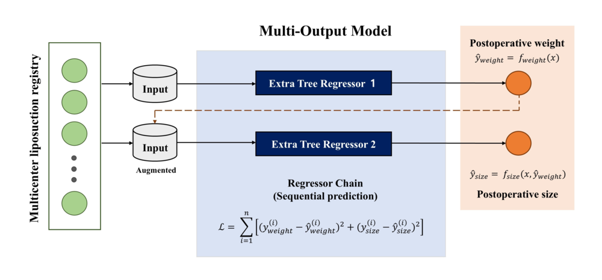
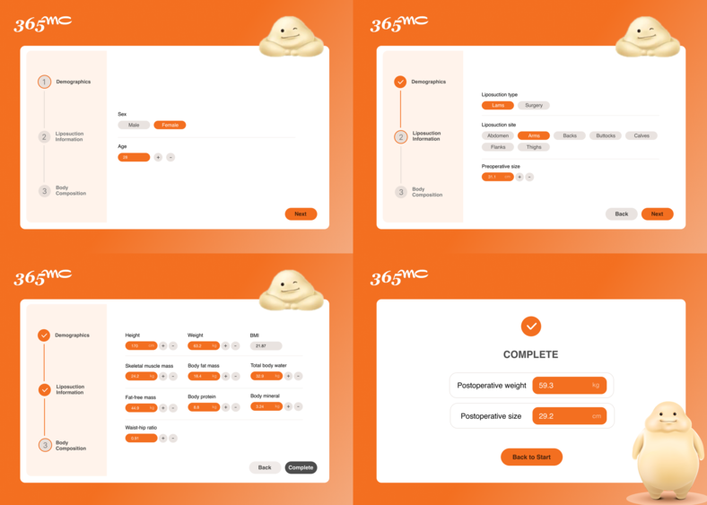

# 365mc Multi-output ML-based CDSS

A machine learning-based clinical decision support system (CDSS) for predicting postoperative liposuction outcomes.

This repository contains a multi-output prediction pipeline and a Streamlit-based CDSS prototype for individualized postoperative outcome prediction using demographic, surgical, and body composition variables.

---

## Overview

The final deployed model is a **chained Extra Trees regressor** designed for **multi-output prediction** of postoperative liposuction outcomes.

The current prototype predicts:

- **Postoperative weight**
- **Postoperative body size**

The repository includes:

- trained model artifacts
- model development notebooks
- model interpretation outputs
- a Streamlit-based user interface for prediction

---

## Representative Model Performance

The representative final model was a **chained Extra Trees regressor**, which showed strong predictive performance for postoperative outcome prediction.

| Model | Prediction Task | R² | RMSE | MAE | MAPE |
|------|------------------|----|------|-----|------|
| Chained Extra Trees | Postoperative outcome prediction | **0.980** | **2.356** | **1.242** | **2.199** |

Additional ablation analysis showed that model performance remained high even when preoperative size was excluded.

| Setting | R² |
|---------|----|
| Final chained Extra Trees model | **0.980** |
| Without preoperative size | **0.975** |

These results support the feasibility of multi-output machine learning for individualized postoperative prediction.

---

## Model Architecture

<p align="center">
  
</p>

The final model uses a **regressor chain** structure with sequential prediction:

1. **Extra Tree Regressor 1** predicts postoperative weight  
2. **Extra Tree Regressor 2** predicts postoperative size using the original input features together with the predicted postoperative weight  

This chained structure allows the model to account for the dependency between postoperative outcomes.

---

## Input Data

The model was developed using a de-identified multicenter liposuction cohort from the 365MC network in South Korea.

| Item | Description |
|------|-------------|
| Source | 365MC multicenter liposuction registry |
| Study period | 2024 |
| Clinical sites | 20 obesity specialty clinics |
| Final cohort | 7804 eligible individuals |
| Modeling task | multi-output regression |
| Input type | preoperative demographic, surgical, anthropometric, and body composition variables |
| Output targets | postoperative body weight and postoperative circumferential size |

---

## Input Features

The final model uses 15 preoperative predictors.

| Category | Input variables |
|----------|-----------------|
| Demographics | sex, age |
| Anthropometrics | height, preoperative body weight, BMI, preoperative circumferential size |
| Surgical information | liposuction technique, liposuction site |
| Body composition | skeletal muscle mass, body fat mass, total body water, fat-free mass, body protein, body mineral content, waist-to-hip ratio |

These variables are entered through the Streamlit CDSS interface and are processed using the saved preprocessing objects before model inference.

---

## CDSS Prototype

<p align="center">
  
</p>

The Streamlit-based CDSS prototype provides a step-by-step workflow for:

1. **Demographics input**
2. **Liposuction information input**
3. **Body composition input**
4. **Prediction output display**

The application is designed as a research-oriented prototype for intuitive postoperative outcome prediction.

---

## Repo Layout

```text
365MC-multioutput-ml/
|-- app/                 Streamlit CDSS application
|   `-- page.py
|
|-- assets/              Static application assets and UI images
|
|-- data/                De-identified analytic datasets
|   |-- processed/
|   |-- train_x.csv
|   |-- train_y.csv
|   |-- test_x.csv
|   `-- test_y.csv
|
|-- models/              Runtime model artifacts
|   |-- chained_et_final.pkl
|   `-- scaler_bundle.pkl
|
|-- notebooks/           Research and model development notebooks
|   |-- 02-eda.ipynb
|   |-- 03-modeling.ipynb
|   `-- 04-modeling-final-chain-et.ipynb
|
|-- reports/             Model figures and screenshots
|   |-- model_architecture.png
|   |-- cdss_overview.png
|   |-- correlation_matrix.png
|   |-- feature_selection(L1).png
|   |-- shap_et_weight_step1.png
|   `-- shap_et_size_step2.png
|
|-- requirements.txt
`-- README.md
```

---

## Quick Start

### Installation

```bash
git clone https://github.com/syselina/365MC-multioutput-ml.git
cd 365MC-multioutput-ml
pip install -r requirements.txt
```

### Run the App

```bash
streamlit run app/page.py
```

---

## Notes

This repository is intended for research, demonstration, and portfolio purposes.

The included CDSS is a prototype implementation and should be interpreted as a decision-support tool rather than a standalone clinical decision-making system.

---

## Disclaimer

This application is a research prototype for postoperative liposuction outcome prediction.  
It is not intended to replace professional clinical judgment, physician decision-making, or institutional protocols.